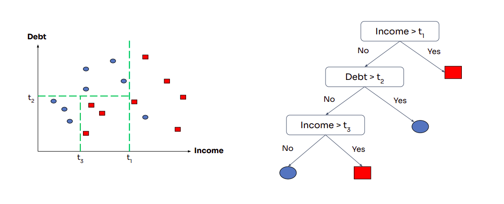

# Decision Tree Classifier

## Daftar Isi

- [Decision Tree Classifier](#decision-tree-classifier)
  - [Daftar Isi](#daftar-isi)
  - [Definisi](#definisi)
      - [Struktur dasar Decision Tree](#struktur-dasar-decision-tree)
      - [Tipe-Tipe Decision Tree](#tipe-tipe-decision-tree)
      - [Definisi Formal \& Sifat Non-Linear](#definisi-formal--sifat-non-linear)
  - [Tabel Perbandingan](#tabel-perbandingan)
  - [Cara Kerja](#cara-kerja)
  - [Metode Pemisahan](#metode-pemisahan)
      - [Kenapa Entropy/Gini, Bukan Misclassification Loss?](#kenapa-entropygini-bukan-misclassification-loss)
      - [Contoh Implementasi Split (Scikitlearn):](#contoh-implementasi-split-scikitlearn)
  - [Regularisasi](#regularisasi)
      - [1. Stopping Criteria (Pre-Pruning)](#1-stopping-criteria-pre-pruning)
      - [2. Pruning (Post-Pruning)](#2-pruning-post-pruning)
      - [Implementasi Regularisasi (Scikit-learn):](#implementasi-regularisasi-scikit-learn)
  - [Kompleksitas Komputasi](#kompleksitas-komputasi)
  - [Kelebihan](#kelebihan)
  - [Kekurangan](#kekurangan)
  - [Implementasi](#implementasi)
  - [Referensi](#referensi)

## Definisi
Decision Tree adalah model prediktif berbentuk seperti pohon yang digunakan dalam machine learning untuk membantu pengambilan keputusan. Model ini memetakan berbagai pilihan dan hasil yang mungkin berdasarkan fitur-fitur dalam data.


#### Struktur dasar Decision Tree
- Root Node: Titik awal yang mewakili seluruh dataset.
- Branches: Jalur yang menghubungkan antar node, menunjukkan alur keputusan.
- Internal Nodes / Decision Node: Titik di mana keputusan dibuat berdasarkan fitur tertentu.
- Leaf Nodes / Terminal Node: Titik akhir yang menunjukkan hasil atau prediksi akhir.

#### Tipe-Tipe Decision Tree
- **Classification Tree:**  
  Digunakan untuk memprediksi hasil kategorikal seperti spam atau bukan spam. Tipe ini membagi data berdasarkan fitur-fitur tertentu untuk mengklasifikasikan data ke dalam kategori yang telah ditentukan sebelumnya.
- **Regression Tree:**  
  Digunakan untuk memprediksi hasil kontinu seperti harga rumah. Tipe ini memberikan prediksi berupa nilai numerik berdasarkan fitur-fitur input.

#### Definisi Formal & Sifat Non-Linear
Secara formal, Decision Tree dapat dipandang sebagai pemetaan dari sejumlah region input $\{R_1, R_2, \dots, R_k\}$ ke prediksi yang bersesuaian $\{w_1, w_2, \dots, w_k\}$. Region-region ini wajib membentuk partisi dari seluruh domain input $\mathcal{X}$, artinya tidak boleh ada irisan antar-region dan gabungan seluruh region harus menutupi seluruh domain:

$$\mathcal{X} = \bigcup_{i=1}^{k} R_i \quad \text{dengan} \quad R_i \cap R_j = \emptyset \text{ untuk } i \neq j$$

Prediksi untuk sembarang titik $x$ kemudian dapat dituliskan secara kompak sebagai:

$$f(x) = \sum_{j=1}^{k} w_j \cdot \mathbb{1}[x \in R_j]$$

di mana $\mathbb{1}[\cdot]$ adalah fungsi indikator yang bernilai 1 jika $x$ berada di region $R_j$, dan 0 jika tidak.




**Kenapa disebut non-linear?**  
Suatu model disebut linear jika hipotesisnya hanya bisa berbentuk $h(x) = \theta^T x$. Decision Tree tidak terikat pada bentuk ini: dengan mempartisi input space menjadi region-region axis-aligned (karena tiap split hanya bergantung pada satu fitur), Decision Tree bisa menghasilkan decision boundary berbentuk kotak-kotak yang mustahil direpresentasikan oleh satu hyperplane linear. Ini membuat Decision Tree tergolong salah satu algoritma non-linear paling awal dalam machine learning, tanpa perlu feature mapping seperti pada kernel SVM.

## Tabel Perbandingan

| Aspek                  | Decision Tree Classifier                     | Decision Tree Regressor                           |
| ---------------------- | -------------------------------------------- | ------------------------------------------------- |
| **Output**             | Label kategori (diskrit)                     | Nilai numerik (kontinu)                           |
| **Contoh Masalah**     | Spam/Not Spam, Sakit/Sehat, Sentimen Pos/Neg | Harga rumah, Suhu udara, Nilai saham              |
| **Kriteria Split**     | Gini Impurity, Entropy                       | MSE, MAE, Poisson Deviance                        |
| **Prediksi Leaf Node** | Kelas mayoritas dari sampel di node          | Rata-rata nilai target pada node                  |
| **Tujuan Split**       | Membuat node homogen (satu kelas dominan)    | Membuat node dengan varian target sekecil mungkin |
| **Evaluasi Kinerja**   | Akurasi, Precision, Recall, F1-Score         | MSE, RMSE, MAE, R² Score                          |

## Cara Kerja
1) **Mulai dari Root Node**  
  Proses dimulai dengan seluruh data berada di node akar (root). Sebelum pembentukan pohon dimulai, kita harus menentukan [Metode Pemisahan](#metode-pemisahan) seperti Gini Impurity atau Entropy saat menginisialisasi model.
2) **Evaluasi Fitur untuk Split.**  
  Setiap fitur diuji untuk melihat seberapa baik ia dapat memisahkan data. Ini dilakukan dengan menghitung nilai impurity (ketidakmurnian) sebelum dan sesudah pemisahan.

   > **Catatan efisiensi pencarian threshold:** Untuk setiap fitur $x_j$, kita tidak perlu menguji threshold di seluruh bilangan real. Cukup urutkan nilai fitur tersebut $x_j^{(i_1)} \leq x_j^{(i_2)} \leq \dots \leq x_j^{(i_n)}$, lalu uji kandidat threshold di titik tengah antar nilai yang berurutan:
   >
   > $$\theta = \frac{x_j^{(i_\ell)} + x_j^{(i_{\ell+1})}}{2}$$
   >
   > Sehingga untuk $n$ sampel, hanya ada $n-1$ kandidat threshold per fitur. Inilah yang membuat greedy splitting tetap layak secara komputasi. Mencari pohon yang benar-benar optimal secara global diketahui bersifat NP-complete (intractable).

3) **Pilih Split Terbaik.**  
  Fitur dan nilai threshold yang menghasilkan penurunan impurity terbesar akan dipilih sebagai split.
4) **Buat cabang dan Ulangi.**  
  Proses ini diulang secara rekursif untuk setiap cabang hingga mencapai kondisi berhenti ([Regularisasi](#regularisasi)).
5) **Prediksi di Leaf Node.**  


## Metode Pemisahan
Berikut adalah metode split yang umum digunakan dalam Decision Tree, khususnya untuk **Klasifikasi**:

1) **Gini Impurity.**  
   Gini Impurity mengukur seberapa besar kemungkinan sebuah sampel akan salah diklasifikasikan jika dipilih secara acak dari suatu node.  
   - Nilai **0** → node sangat murni (semua data dalam satu kelas).  
   - Semakin mendekati **0.5** (untuk kasus 2 kelas) → node semakin tidak murni (data tersebar di beberapa kelas).  

   **Rumus Gini:**

   $$Gini = 1 - \sum_{i=1}^{K} p_i^2$$

   di mana $p_i$ adalah proporsi sampel dari kelas ke-$i$ dalam node tersebut.  

   **Contoh:**  
   Jika sebuah node memiliki 70% data kelas A dan 30% kelas B:  

   $$Gini = 1 - (0.7^2 + 0.3^2) = 1 - (0.49 + 0.09) = 0.42$$

   > **Generalisasi untuk Multi-Class:** Nilai maksimum Gini bergantung pada jumlah kelas $K$. Saat distribusi kelas seimbang sempurna ($p_i = 1/K$ untuk semua $i$), nilai maksimumnya adalah:
   >
   > $$Gini_{max} = 1 - K \cdot \left(\frac{1}{K}\right)^2 = \frac{K-1}{K}$$
   >
   > Untuk $K=2$ (biner), nilai maksimumnya 0.5, seperti dibahas di atas. Namun untuk $K=3$ dengan distribusi seimbang (masing-masing kelas 33.3%):
   >
   > $$Gini = 1 - 3 \times (0.333)^2 = 1 - 0.333 = 0.667$$
   >
   > Jadi nilai maksimum Gini terus naik seiring bertambahnya jumlah kelas. Patokan "0.5" hanya berlaku untuk kasus biner ($K=2$).
   
2) **Entropy and Information Gain.**  
   Entropy mengukur tingkat ketidakpastian dalam distribusi kelas. Semakin tinggi entropy, semakin acak data tersebut. Tujuan split adalah **mengurangi entropy**, sehingga node lebih homogen.  
   - **Entropy = 0** → node murni (semua data satu kelas).  
   - **Entropy maksimum (misalnya 1 untuk dua kelas seimbang)** → distribusi data benar-benar acak.  

   **Rumus Entropy:**

   $$Entropy = - \sum_{i=1}^{K} p_i \log_2(p_i)$$

   dengan $p_i$ adalah proporsi sampel dari kelas ke-$i$.  

   **Rumus Information Gain (IG):**

   $$IG = Entropy_{\text{parent}} - \sum_{j=1}^{n} \frac{N_j}{N} \cdot Entropy_j$$

   dengan:  
   - $Entropy_{\text{parent}}$ = entropy sebelum split,  
   - $Entropy_j$ = entropy cabang ke-$j$,  
   - $N_j$ = jumlah sampel di cabang ke-$j$,  
   - $N$ = total sampel.  

   **Contoh:**  
   Jika sebuah node berisi 50% kelas A dan 50% kelas B:  

   $$Entropy = - (0.5 \log_2 0.5 + 0.5 \log_2 0.5) = 1$$  

   Jika setelah split, setiap cabang hanya berisi satu kelas → entropy cabang = 0, sehingga:  

   $$IG = 1 - 0 = 1$$

   > **Generalisasi untuk Multi-Class:** Nilai maksimum Entropy juga bergantung pada $K$. Saat distribusi kelas seimbang sempurna, nilai maksimumnya adalah:
   >
   > $$Entropy_{max} = \log_2(K)$$
   >
   > Untuk $K=2$, nilai maksimumnya 1 bit, seperti dibahas di atas. Untuk $K=3$ dengan distribusi seimbang (masing-masing kelas 33.3%):
   >
   > $$Entropy = -3 \times (0.333 \times \log_2 0.333) \approx -3 \times (0.333 \times -1.585) \approx 1.585$$
   >
   > yang memang sama dengan $\log_2(3) \approx 1.585$. Semakin banyak kelas, semakin besar pula entropy maksimum yang bisa dicapai.

3) **Misclassification Loss.**  
   Mengukur proporsi sampel yang akan salah diklasifikasikan jika kita memprediksi kelas mayoritas pada suatu region $R$.

   **Rumus:**

   $$L_{misclass}(R) = 1 - \max_c(\hat{p}_c)$$

   dengan $\hat{p}_c$ adalah proporsi sampel kelas $c$ dalam region $R$.

   **Kenapa metode ini jarang dipakai untuk memilih split?**  
   Misclassification Loss kurang sensitif terhadap perubahan distribusi kelas. Contoh: sebuah parent region berisi 400 sampel positif dan 100 sampel negatif, dan displit menjadi dua kemungkinan:

   - **Split A** → $R_1$: 150+/100−, $R_2$: 250+/0−
   - **Split B** → $R_1'$: 300+/100−, $R_2'$: 100+/0−

   Walaupun Split A tampak lebih baik secara intuitif (berhasil mengisolasi region yang 100% murni positif), kedua split ini menghasilkan **weighted misclassification loss yang identik** (= 100), bahkan sama persis dengan loss milik parent-nya. Artinya, Misclassification Loss gagal membedakan kualitas kedua split tersebut. Inilah salah satu alasan utama Gini Impurity dan Entropy lebih disukai dalam praktik.

   > **Generalisasi untuk Multi-Class:** Rumus $L_{misclass}(R) = 1 - \max_c(\hat{p}_c)$ sudah berlaku umum untuk sembarang jumlah kelas $K$ tanpa perlu modifikasi. Nilai maksimumnya mengikuti pola yang sama dengan Gini, yaitu $(K-1)/K$ saat distribusi kelas seimbang sempurna. Contoh untuk $K=3$ kelas dengan distribusi seimbang (masing-masing 33.3%):
   >
   > $$L_{misclass} = 1 - 0.333 = 0.667$$
   >
   > Namun terlepas dari nilai maksimumnya yang mirip Gini, masalah sensitivitas yang dibahas sebelumnya (kasus Split A vs Split B) tetap berlaku untuk sembarang $K$. Inilah kenapa Entropy/Gini tetap lebih disukai walaupun nilai maksimumnya sama.

#### Kenapa Entropy/Gini, Bukan Misclassification Loss?
Entropy (dan Gini) bersifat **strictly concave**. Secara matematis, sifat ini menjamin bahwa selama proporsi kelas pada kedua child region berbeda ($\hat{p}_1 \neq \hat{p}_2$) dan keduanya tidak kosong, maka:

$$\frac{|R_1|L(R_1) + |R_2|L(R_2)}{|R_1|+|R_2|} < L(R_p)$$

akan **selalu** terpenuhi: weighted loss anak pasti lebih kecil dari loss induk. Jaminan semacam ini **tidak berlaku** untuk Misclassification Loss, yang bersifat piecewise-linear (bukan strictly concave), sehingga bisa menghasilkan kasus seperti pada contoh Split A vs Split B di atas.

#### Contoh Implementasi Split (Scikitlearn):
```
DecisionTreeClassifier(criterion='gini')       # Untuk klasifikasi dengan Gini
DecisionTreeClassifier(criterion='entropy')    # Untuk klasifikasi dengan Entropy
```

## Regularisasi
Karena Decision Tree bisa terus tumbuh hingga mencapai loss nol pada data training (setiap leaf hanya berisi satu sampel), model menjadi sangat rentan terhadap overfitting (variance tinggi, bias rendah). Ada dua pendekatan utama untuk mengatasinya:

#### 1. Stopping Criteria (Pre-Pruning)
Menghentikan pertumbuhan pohon lebih awal berdasarkan kondisi tertentu:

- **Minimum Leaf Size**: Tidak melakukan split jika jumlah sampel di region $R$ berada di bawah threshold tertentu.
- **Maximum Depth**: Tidak melakukan split jika kedalaman node sudah melebihi threshold.
- **Maximum Number of Nodes**: Menghentikan pertumbuhan jika jumlah leaf node sudah melebihi threshold.

> **Catatan penting:** Menetapkan *minimum decrease in loss* sebagai kriteria berhenti sebenarnya kurang tepat. Karena Decision Tree membangun split satu fitur pada satu waktu (greedy), interaksi antar-fitur berorde tinggi terkadang baru terlihat manfaatnya setelah beberapa split berturut-turut. Jika kita berhenti terlalu dini hanya karena satu split pertama tidak banyak menurunkan loss, kita berisiko kehilangan interaksi penting yang seharusnya bisa ditangkap beberapa langkah kemudian.

#### 2. Pruning (Post-Pruning)
Alternatif lain: biarkan tree tumbuh penuh terlebih dahulu (hingga loss nol), lalu **pangkas** node yang paling sedikit berkontribusi terhadap performa, diukur menggunakan validation set. Proses pemangkasan ini biasanya juga dilakukan secara greedy, namun arahnya kebalikan dari proses fitting, dimulai dari leaf menuju root.

#### Implementasi Regularisasi (Scikit-learn):
```python
DecisionTreeClassifier(
    max_depth=5,             # Maximum Depth
    min_samples_leaf=10,     # Minimum Leaf Size
    min_samples_split=20,    # Minimum jumlah sampel agar node dipertimbangkan untuk split
    max_leaf_nodes=50,       # Maximum Number of Nodes
    ccp_alpha=0.01           # Cost-Complexity Pruning (post-pruning)
)
```

## Kompleksitas Komputasi
Misalkan terdapat $n$ sampel, $f$ fitur, dan tree dengan kedalaman $d$:

- **Waktu Prediksi:** $O(d)$. Untuk satu sampel, kita hanya perlu menelusuri satu jalur dari root ke leaf. Jika tree seimbang (balanced), maka $d = O(\log n)$, sehingga prediksi menjadi sangat cepat.
- **Waktu Training:** $O(nfd)$, tergolong relatif efisien, mengingat ukuran data matrix itu sendiri sudah berorde $O(nf)$.

## Kelebihan
1) **Serbaguna.**  
  Dapat dipakai untuk **klasifikasi** dan **regresi**.
2) **Tanpa Skala Fitur.**  
  Tidak perlu normalisasi/standarisasi fitur numerik terlebih dahulu.
3) **Menangani Hubungan Non-Linear.**  
  Mampu menangkap hubungan kompleks dan non-linear antara fitur dan hasil secara efektif.
4) **Interpretabilitas Tinggi.**  
  Struktur pohon yang jelas memudahkan pengguna memahami alasan di balik setiap keputusan yang diambil.
5) **Mendukung Variabel Kategorikal.**  
  Decision Tree dapat langsung menangani fitur kategorikal (misalnya `loc ∈ {Utara, Selatan, Khatulistiwa}`) dengan menguji keanggotaan subset kategori secara langsung, tanpa perlu one-hot encoding seperti pada algoritma lain. Catatan: untuk fitur dengan jumlah kategori $|S|$ yang besar, jumlah kemungkinan split tumbuh sebesar $2^{|S|}$ (power set), sehingga bisa menjadi tidak praktis secara komputasi dan berisiko overfitting jika kategori terlalu banyak.

## Kekurangan
1) Overfitting , Decision Tree bisa tumbuh terlalu dalam dan rumit, menyesuaikan setiap detail termasuk noise (data yang tidak mewakili pola sebenarnya).misal jika ada 1 data outlier, pohon bisa membuat cabang khusus hanya untuk data itu = memicu overfitting
2) Perubahan kecil pada data (menambah/menghapus 1 sampel) bisa menghasilkan struktur pohon yang sangat berbeda.
3) Pembelajaran serakah (greedy) ,Pohon dibentuk dengan memilih split terbaik di tiap langkah secara lokal (greedy) sehingga tidak menjamin struktur pohon terbaik secara keseluruhan (global optimal).
4) Bias kelas , kelas mayoritas dapat mendominasi pembelahan (split), menyebabkan bias.
5) **Lack of Additive Structure (Tidak Menangkap Struktur Aditif).**  
   Decision Tree kesulitan memodelkan hubungan aditif sederhana seperti $x_1 + x_2$, karena setiap split hanya mempertimbangkan satu fitur pada satu waktu (axis-aligned). Untuk mengaproksimasi boundary diagonal seperti itu, Decision Tree membutuhkan sangat banyak split kecil yang membentuk pola "tangga", sedangkan model linear bisa langsung merepresentasikannya hanya dengan satu garis.

## Implementasi
```python
from sklearn.tree import DecisionTreeClassifier, plot_tree
from sklearn.model_selection import train_test_split
from sklearn.metrics import classification_report, accuracy_score, confusion_matrix
import matplotlib.pyplot as plt
import numpy as np

# Buat dataset sintetis (40 sampel, 2 fitur)
np.random.seed(42)
X_class0 = np.random.randn(20, 2) * 0.5 + np.array([-1, -1])  # kelas 0
X_class1 = np.random.randn(20, 2) * 0.5 + np.array([1, 1])    # kelas 1
X = np.vstack([X_class0, X_class1])
y = np.array([0]*20 + [1]*20)

plt.figure(figsize=(6, 6))
plt.scatter(X_class0[:, 0], X_class0[:, 1], color='blue', label='Class 0')
plt.scatter(X_class1[:, 0], X_class1[:, 1], color='red', label='Class 1')
plt.xlabel('Feature 1')
plt.ylabel('Feature 2')
plt.title('Synthetic Dataset: Two Clusters')
plt.legend()
plt.grid(True)
plt.show()

# Split train/test
X_train, X_test, y_train, y_test = train_test_split(
    X, y, test_size=0.3, random_state=42, stratify=y
)

# Buat model Decision Tree
dt = DecisionTreeClassifier(
    criterion='gini',
    max_depth=4,
    min_samples_leaf=2,
    random_state=42
)

# Training dan Evaluasi
dt.fit(X_train, y_train)
y_pred = dt.predict(X_test)

print("Accuracy:", accuracy_score(y_test, y_pred))
print("Confusion matrix:\n", confusion_matrix(y_test, y_pred))
print(classification_report(y_test, y_pred))

# Visualisasi pohon
plt.figure(figsize=(8,8))
plot_tree(dt, filled=True, rounded=True, feature_names=['f0','f1'], class_names=['0','1'])
plt.show()
```

## Referensi
- https://scikit-learn.org/stable/modules/tree.html
- CS229 Lecture Notes: Decision Trees, Selwin George, Stanford University (2023)
- CS229 Lecture Notes: Decision Trees, Raphael John Lamarre Townshend, Stanford University (2018)
- CS229 Slides: Decision Trees, Stanford University (14 Mei 2021)
