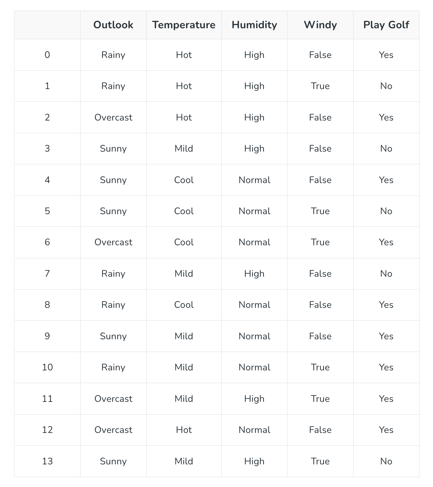
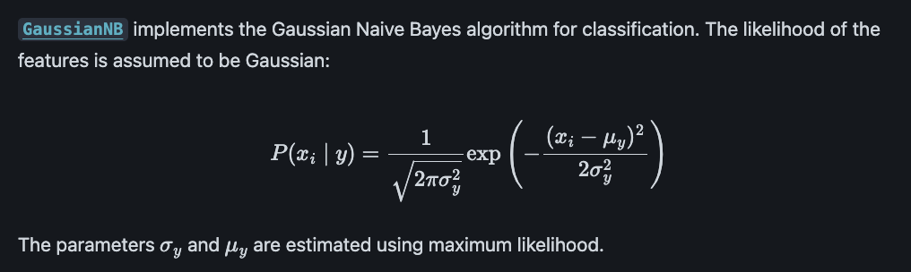
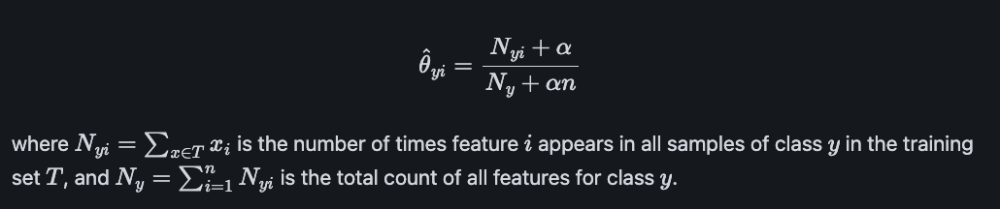
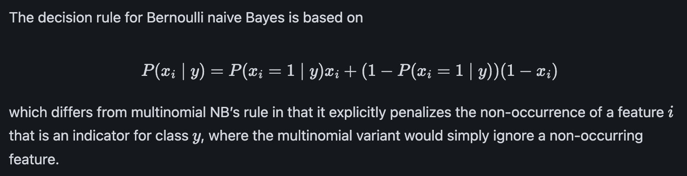
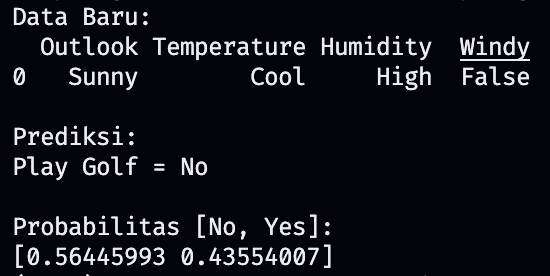

# Naive Bayes

## Daftar Isi

- [Daftar Isi](#daftar-isi)
- [Definisi](#definisi)
- [Cara Kerja](#cara-kerja)
- [Kelebihan](#kelebihan)
- [Kekurangan](#kekurangan)
- [Implementasi](#implementasi)
- [Referensi](#referensi)

## Definisi


**Naive Bayes** adalah algoritma klasifikasi **supervised learning** yang didasarkan pada **teorema Bayes**, dengan asumsi **independensi kondisional** antar fitur (bersifat "naïf"). Dengan kata lain, satu fitur dianggap tidak memengaruhi fitur lainnya, jika sudah diketahui kelas targetnya. Hal ini membuat perhitungan lebih sederhana dan efisien.

Terdapat 2 istilah dalam Naive Bayes:

| Konsep | Deskripsi |
|---|---|
| **Bayes** | Model menghitung probabilitas suatu kelas berdasarkan evidence atau fitur yang diamati. |
| **Naive** | Model membuat asumsi sederhana bahwa fitur-fitur tersebut saling independen *conditional* terhadap kelas. |

Naive Bayes berasal dari *Bayes Theorem*. Rumusnya adalah:

$$
P(Y|X) = \frac{P(X|Y)P(Y)}{P(X)}
$$

Keterangan:

- $P(Y|X)$ = **Posterior**, probabilitas kelas $Y$ setelah melihat data $X$
- $P(X|Y)$ = **Likelihood**, probabilitas data $X$ jika kelasnya $Y$
- $P(Y)$ = **Prior**, probabilitas awal kelas $Y$
- $P(X)$ = **Evidence**, probabilitas data $X$

Masalahnya muncul ketika fitur lebih dari satu. Jika terdapat beberapa fitur:

$$
X = (x_1,x_2,\ldots,x_n)
$$

Naive Bayes mengasumsikan:

$$
P(X|Y)
=
\prod_{i=1}^{n}P(x_i|Y)
$$

Setelah kita mengetahui kelas \(Y\), masing-masing fitur dianggap independen satu sama lain.

### Jenis Naive Bayes


| Jenis | Cocok untuk |
|---|---|
| **Gaussian NB** | Fitur kontinu |
| **Multinomial NB** | Fitur diskrit |
| **Bernoulli NB** | Fitur binary |
| **Categorical NB** | Fitur kategorikal |


## Langkah Perhitungan

Misalkan kita ingin memprediksi apakah seseorang akan **Play Golf (`Yes`) atau tidak (`No`)** berdasarkan kondisi cuaca.

### Dataset




Source: https://www.geeksforgeeks.org/machine-learning/naive-bayes-classifiers/

Misalkan terdapat data baru:

$$
X=(Sunny,Cool,High,False)
$$

Kita ingin menentukan:

$$
Play\ Golf = Yes \quad \text{atau} \quad Play\ Golf = No
$$

Perhitungan Naive Bayes dibagi menjadi tiga tahap:

1. **Prior Probability**
2. **Likelihood**
3. **Posterior Probability**

### 1. Prior Probability

Prior adalah probabilitas awal dari masing-masing kelas sebelum melihat fitur data baru.

Dari 14 data:
- `Yes` = 9 data
- `No` = 5 data

| Class | Count | Prior |
|-------|------:|------:|
| Yes | 9 | $\frac{9}{14} \approx 0.643$ |
| No  | 5 | $\frac{5}{14} \approx 0.357$ |

---

### 2. Likelihood

Data baru memiliki empat fitur:
- Outlook = Sunny
- Temperature = Cool
- Humidity = High
- Windy = False

Kita menghitung probabilitas setiap fitur terhadap masing-masing kelas.

| Fitur | $P(\text{Fitur} \mid Yes)$ | $P(\text{Fitur} \mid No)$ |
|-------|---------------------------:|--------------------------:|
| Outlook = Sunny     | $\frac{2}{9}$ | $\frac{3}{5}$ |
| Temperature = Cool  | $\frac{3}{9}$ | $\frac{1}{5}$ |
| Humidity = High     | $\frac{3}{9}$ | $\frac{4}{5}$ |
| Windy = False       | $\frac{6}{9}$ | $\frac{2}{5}$ |

Likelihood dihitung dengan mengalikan seluruh probabilitas kondisional tiap fitur:

$$
P(X \mid Yes)
= \frac{2}{9} \times \frac{3}{9} \times \frac{3}{9} \times \frac{6}{9}
= \frac{108}{6561}
\approx 0.01646
$$

$$
P(X \mid No)
= \frac{3}{5} \times \frac{1}{5} \times \frac{4}{5} \times \frac{2}{5}
= \frac{24}{625}
= 0.0384
$$

---

### 3. Posterior Probability

Gabungkan **Prior** dan **Likelihood** untuk menghitung score masing-masing kelas:

$$
\text{Score}(Yes) = P(Yes) \times P(X \mid Yes)
= \frac{9}{14} \times 0.01646
\approx 0.01058
$$

$$
\text{Score}(No) = P(No) \times P(X \mid No)
= \frac{5}{14} \times 0.0384
\approx 0.01371
$$

| Class | Prior | Likelihood | Score |
|-------|------:|-----------:|------:|
| Yes | 0.643 | 0.01646 | 0.01058 |
| **No** | 0.357 | 0.03840 | **0.01371** |

Normalisasi score untuk mendapatkan posterior probability sesungguhnya:

$$
P(Yes \mid X)
= \frac{0.01058}{0.01058 + 0.01371}
\approx 0.436
$$

$$
P(No \mid X)
= \frac{0.01371}{0.01058 + 0.01371}
\approx 0.564
$$

| Class | Posterior Probability |
|-------|----------------------:|
| Yes | 0.436 |
| **No** | **0.564** |

Karena $P(No \mid X) > P(Yes \mid X)$, maka: 
$$
{Play\ Golf = No}
$$

Jadi, berdasarkan perhitungan **Naive Bayes**, data baru diprediksi **`No`** (tidak bermain golf).

### 4. Laplace Smoothing

   Masalah utama pada Naive Bayes adalah ketika suatu **fitur tidak pernah muncul** dalam data latih untuk kelas tertentu.  
   
   Misalkan `Temperature = Cool` tidak pernah muncul pada kelas `No`, sehingga:

   $$
   P(Cool|No) = \frac{0}{5} = 0
   $$

   Akibatnya, seluruh likelihood kelas `No` menjadi `0`:

   $$
   P(X|No) = \frac{3}{5} \times \frac{0}{5} \times \frac{3}{5} \times \frac{2}{5} = 0
   $$

   Dan skor kelas `No` pun menjadi `0`:

   $$
   Score(No) = P(No) \times P(X|No) = \frac{5}{14} \times 0 = 0
   $$
   
   Hasil ini bermasalah karena:
   - Jika ada **satu fitur dengan probabilitas nol**, maka seluruh hasil perkalian posterior akan menjadi **nol**.
   - Akibatnya, data langsung dianggap **Yes atau Bermain Golf**, hanya karena satu fitur yang tidak muncul di data train.
   
   Untuk mengatasi hal ini digunakan **Laplace Smoothing** (atau *add-one smoothing*):
   - Tambahkan **+1** pada setiap hitungan kata.  
   - Tambahkan jumlah total kata unik pada penyebut.  
   
   Sehingga perhitungan berubah:

   $$
   P(Cool|No) = \frac{0+1}{5+(1)(3)} = \frac{1}{8} = 0.125
   $$
   
   Dengan cara ini:
   - Probabilitas tidak pernah benar-benar **0**, hanya menjadi **sangat kecil**.  
   - Model jadi lebih **robust** terhadap data-data baru atau jarang muncul.

## Bagaimana dengan tipe data yang lain?

Selain Categorical Naive Bayes, terdapat beberapa varian Naive Bayes yang digunakan sesuai dengan tipe datanya.

### 1. Gaussian Naive Bayes

Source: https://scikit-learn.org/stable/modules/naive_bayes.html

Gaussian NB digunakan untuk fitur **numerik kontinu**. Likelihood dihitung menggunakan distribusi normal.

Dataset:

| Tinggi (cm) | Berat (kg) | Umur | Kelas |
|---:|---:|---:|---|
| 158 | 52 | 22 | A |
| 162 | 58 | 24 | A |
| 172 | 68 | 28 | B |
| 178 | 74 | 32 | B |

**Data baru:** Tinggi = 165, Berat = 60, Umur = 26

---

**Statistik per kelas:**

| Kelas | Prior | μ (Tinggi, Berat, Umur) | σ² (Tinggi, Berat, Umur) |
|---|---:|---|---|
| A | 2/4 | 160, 55, 23 | 4, 9, 1 |
| B | 2/4 | 175, 71, 30 | 9, 9, 4 |

**Likelihood kelas A:**

$$
P(165 \mid A) = \frac{1}{\sqrt{2\pi(4)}}e^{-\frac{(165-160)^2}{2(4)}} \approx 0.00880
$$

$$
P(60 \mid A) = \frac{1}{\sqrt{2\pi(9)}}e^{-\frac{(60-55)^2}{2(9)}} \approx 0.06562
$$

$$
P(26 \mid A) = \frac{1}{\sqrt{2\pi(1)}}e^{-\frac{(26-23)^2}{2(1)}} \approx 0.01110
$$

$$
P(X \mid A) = 0.00880 \times 0.06562 \times 0.01110 \approx 6.406 \times 10^{-6}
$$

**Likelihood kelas B:**

$$
P(165 \mid B) = \frac{1}{\sqrt{2\pi(9)}}e^{-\frac{(165-175)^2}{2(9)}} \approx 0.01658
$$

$$
P(60 \mid B) = \frac{1}{\sqrt{2\pi(9)}}e^{-\frac{(60-71)^2}{2(9)}} \approx 0.00792
$$

$$
P(26 \mid B) = \frac{1}{\sqrt{2\pi(4)}}e^{-\frac{(26-30)^2}{2(4)}} \approx 0.12952
$$

$$
P(X \mid B) = 0.01658 \times 0.00792 \times 0.12952 \approx 1.700 \times 10^{-5}
$$

**Score:**

$$
\text{Score}(A) = \tfrac{1}{2} \times 6.406\times10^{-6} \approx 3.203\times10^{-6}
$$

$$
\text{Score}(B) = \tfrac{1}{2} \times 1.700\times10^{-5} \approx 8.500\times10^{-6}
$$

Karena $\text{Score}(B) > \text{Score}(A)$:

$$
{\text{Prediksi} = B}
$$

### 2. Multinomial Naive Bayes


Source: https://scikit-learn.org/stable/modules/naive_bayes.html

Multinomial NB digunakan untuk data **diskrit berupa jumlah atau frekuensi**, terutama pada klasifikasi teks.

Misalkan terdapat jumlah kemunculan kata pada dua dokumen:

| Dokumen | `gratis` | `promo` | Kelas |
|---|---:|---:|---|
| D1 | 3 | 2 | Spam |
| D2 | 1 | 0 | Bukan Spam |
| D3 | 2 | 1 | Spam |

Misalkan ingin menghitung:

$$
P(gratis|Spam)
$$

Jumlah kemunculan `gratis` pada kelas `Spam`:

$$
N_{gratis,Spam}=3+2=5
$$

Total seluruh kata pada kelas `Spam`:

$$
N_{Spam}=3+2+2+1=8
$$

Dengan Laplace smoothing ($\alpha=1$) dan vocabulary berjumlah 2:

$$
P(gratis|Spam)
=
\frac{5+1}{8+(1)(2)}
=
\frac{6}{10}
=
0.6
$$

Multinomial NB memperhatikan **berapa kali fitur muncul**.

### 3. Bernoulli Naive Bayes


Source: https://scikit-learn.org/stable/modules/naive_bayes.html

Bernoulli NB digunakan untuk fitur **binary**, yaitu fitur yang hanya memiliki dua nilai seperti `0/1`, `True/False`, atau `Ada/Tidak Ada`.

Misalkan terdapat dataset:

| Ada Promo | Ada Diskon | Pelanggan Member | Beli |
|---:|---:|---:|---|
| 1 | 1 | 1 | Yes |
| 1 | 0 | 1 | Yes |
| 0 | 1 | 0 | No |

Misalkan ingin menghitung:

$$
P(Ada\ Promo=1|Beli=Yes)
$$

Pada kelas `Yes`, terdapat 2 data dan keduanya memiliki `Ada Promo = 1`.

Dengan Laplace smoothing:

$$
P(Ada\ Promo=1|Yes)
=
\frac{2+1}{2+2}
=
\frac{3}{4}
=
0.75
$$

Bernoulli NB hanya memperhatikan **apakah suatu fitur ada atau tidak**, bukan berapa kali fitur tersebut muncul.

## Kelebihan

- **Cepat dan efisien**: training dan klasifikasi sangat cepat, bahkan untuk dataset besar.  
- **Kebutuhan memori rendah**: hanya perlu menyimpan statistik (prior & likelihood).  
- **Skalabilitas tinggi**: performa tetap baik meski jumlah fitur banyak.  
- **Mudah diimplementasikan**: tersedia di banyak toolkit (misalnya `scikit-learn`).  
- **Efektif dengan sedikit data latih**: masih bekerja baik meski data terbatas.  
- **Cocok untuk data berdimensi tinggi**: seperti klasifikasi teks atau analisis dokumen.  
- **Probabilistik**: memberikan nilai probabilitas untuk setiap kelas.

## Kekurangan

- **Asumsi independensi fitur**: Naive Bayes mengasumsikan bahwa fitur bersifat independen meskipun fitur bisa saja saling berkolerasi.
- **Sensitif terhadap class imbalance**: Karena Naive Bayes menggunakan probabilitas, label mayoritas dapat mendominasi prediksi dan membuat model bias.
- **Sensitif terhadap outlier**: Karena perhitungan probabilitas (terutama pada Gaussian Naive Bayes) sangat dipengaruhi oleh nilai ekstrem.

## Implementasi

Berikut adalah contoh implementasi untuk datasetdari salah satu varian Naive Bayes, yakni Categorical Naive Bayes, menggunakan `scikit-learn`.

```python
import pandas as pd
from sklearn.preprocessing import OrdinalEncoder
from sklearn.naive_bayes import CategoricalNB

# Dataset
data = {
    "Outlook": [
        "Rainy", "Rainy", "Overcast", "Sunny",
        "Sunny", "Sunny", "Overcast", "Rainy",
        "Rainy", "Sunny", "Rainy", "Overcast",
        "Overcast", "Sunny"
    ],
    "Temperature": [
        "Hot", "Hot", "Hot", "Mild",
        "Cool", "Cool", "Cool", "Mild",
        "Cool", "Mild", "Mild", "Mild",
        "Hot", "Mild"
    ],
    "Humidity": [
        "High", "High", "High", "High",
        "Normal", "Normal", "Normal", "High",
        "Normal", "Normal", "Normal", "High",
        "Normal", "High"
    ],
    "Windy": [
        False, True, False, False,
        False, True, True, False,
        False, False, True, True,
        False, True
    ],
    "Play Golf": [
        "Yes", "No", "Yes", "No",
        "Yes", "No", "Yes", "No",
        "Yes", "Yes", "Yes", "Yes",
        "Yes", "No"
    ]
}

df = pd.DataFrame(data)

# Memisahkan fitur (X) dan target (y)
X = df.drop("Play Golf", axis=1)
y = df["Play Golf"].map({"No": 0, "Yes": 1})

# Encoding fitur kategorikal
encoder = OrdinalEncoder()
X_encoded = encoder.fit_transform(X)

# Membuat dan melatih Categorical Naive Bayes
# alpha=0 berarti tidak menerapkan Laplace/add-one smoothing
model = CategoricalNB(alpha=0)
model.fit(X_encoded, y)

# Data baru yang ingin diprediksi
new_data = pd.DataFrame({
    "Outlook": ["Sunny"],
    "Temperature": ["Cool"],
    "Humidity": ["High"],
    "Windy": [False]
})

# Gunakan encoder yang sama untuk data baru
new_data_encoded = encoder.transform(new_data)

# Prediksi
prediction = model.predict(new_data_encoded)
probability = model.predict_proba(new_data_encoded)

print("Data Baru:")
print(new_data)

print("\nPrediksi:")
print("Play Golf =", "Yes" if prediction[0] == 1 else "No")

print("\nProbabilitas [No, Yes]:")
print(probability[0])
```

Outputnya adalah:




To understand more , you guys can watch the youtube videos in the reference
## Referensi
- [GeeksforGeeks - Naive Bayes](https://www.geeksforgeeks.org/machine-learning/naive-bayes-classifiers/)
- [Scikit-Learn - Naive Bayes](https://scikit-learn.org/stable/modules/naive_bayes.html)
- [Youtube - Naive Bayes, Clearly Explained!!!](https://www.youtube.com/watch?v=O2L2Uv9pdDA)
- [Youtube - Gaussian Naive Bayes, Clearly Explained!!!](https://www.youtube.com/watch?v=H3EjCKtlVog)
