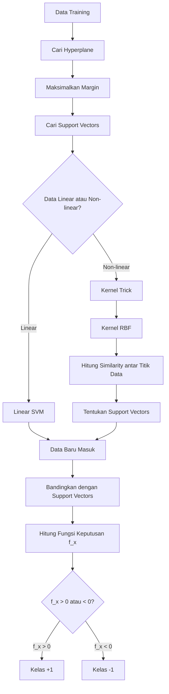

# Support Vector Machine (SVM)

## Daftar Isi
- [Definisi](#definisi)
- [Alur Kerja SVM](#alur-kerja-svm)
- [Cara Kerja](#cara-kerja)
  - [1. Hyperplane Optimal](#1-hyperplane-optimal)
  - [2. Support Vectors](#2-support-vectors)
  - [3. Kernel Trick](#3-kernel-trick)
  - [4. Kernel RBF](#4-kernel-rbf)
  - [5. Fungsi Keputusan](#5-fungsi-keputusan)
- [Kelebihan](#kelebihan)
- [Kekurangan](#kekurangan)
- [Implementasi](#implementasi)
- [Referensi](#referensi)

---

## Definisi

Support Vector Machine (SVM) adalah algoritma supervised learning yang digunakan untuk masalah klasifikasi, regresi, dan pendeteksian outlier. Intinya sederhana, bayangkan ada dua kelompok data, misalnya titik biru dan titik merah. SVM mencari sebuah garis pemisah (disebut **hyperplane**) yang membedakan kedua kelompok tersebut.


Bedanya dengan sekadar mencari garis pemisah biasa, SVM mencari garis yang memiliki **margin** (jarak) paling lebar dari titik terdekat di tiap kelompok. Titik-titik terdekat inilah yang disebut **support vectors**, karena merekalah yang menentukan posisi garis pemisah tersebut.

---

## Alur Kerja SVM



## Cara Kerja

### 1. Hyperplane Optimal

Sebuah hyperplane dituliskan sebagai:

$$\mathbf{w} \cdot \mathbf{x} - b = 0$$

- **w** (weight vector): menentukan arah kemiringan garis.
- **x**: data yang mau diklasifikasi.
- **b** (bias): menggeser posisi garis dari titik nol.

Di kanan-kirinya ada dua batas margin yang sejajar:

$$\mathbf{w} \cdot \mathbf{x} - b = 1 \quad \text{(batas kelas positif)}$$

$$\mathbf{w} \cdot \mathbf{x} - b = -1 \quad \text{(batas kelas negatif)}$$

Jarak antar dua batas ini adalah margin:

$$\text{Margin} = \frac{2}{\|\mathbf{w}\|}$$

Karena margin berbanding terbalik dengan $\|\mathbf{w}\|$, semakin kecil $\|\mathbf{w}\|$ semakin lebar marginnya. Itulah kenapa tujuan SVM sering ditulis sebagai "meminimalkan $\|\mathbf{w}\|$", padahal maksudnya sama saja dengan "memaksimalkan margin", cuma dibalik arah pandangnya.

Dalam praktiknya, bentuk yang dipakai adalah:

$$\min \frac{1}{2} \|\mathbf{w}\|^2$$

Kuadrat dipakai karena $\|\mathbf{w}\|$ mengandung akar yang menyulitkan proses turunan, sedangkan $\|\mathbf{w}\|^2$ lebih mudah dihitung tanpa mengubah hasil solusi. Faktor $\frac{1}{2}$ ditambahkan supaya saat diturunkan, angka 2 yang muncul dari aturan pangkat saling meniadakan, sehingga hasil akhirnya lebih rapi.

Syarat (constraint) yang harus dipenuhi setiap data:

$$y_i (\mathbf{w} \cdot \mathbf{x}_i - b) \geq 1$$

dengan $y_i \in \{-1, +1\}$ (label kelas).

Cara bacanya: $\mathbf{w} \cdot \mathbf{x}_i - b$ adalah skor posisi suatu titik. Mengalikannya dengan label $y_i$ membuat hasilnya selalu positif kalau klasifikasi benar, dan negatif kalau salah, untuk kedua kelas sekaligus tanpa perlu dua rumus terpisah.

Kenapa syaratnya ≥ 1, bukan ≥ 0? Karena SVM tidak cuma menuntut benar, tapi juga menuntut jarak aman dari garis. Titik dengan hasil tepat 1 berarti menempel di tepi margin (support vector), titik dengan hasil > 1 berarti lebih jauh dan lebih aman.

### 2. Support Vectors

Support vectors adalah titik-titik yang membuat syarat di atas menjadi sama persis dengan 1:

$$y_i (\mathbf{w} \cdot \mathbf{x}_i - b) = 1$$

Titik-titik inilah yang "menopang" posisi hyperplane dan margin. Karena hanya support vectors yang dipakai untuk membangun model akhir, SVM jadi hemat memori.

### 3. Kernel Trick

Jika data tidak bisa dipisah dengan satu garis lurus, SVM memakai **kernel trick** untuk memproyeksikan data ke dimensi yang lebih tinggi agar bisa dipisahkan secara linear di sana.


Bayangkan dua kelompok semut (merah dan hijau) di kertas datar 2D, satu kelompok mengelilingi kelompok lain. Mustahil dipisah dengan satu potongan lurus. Kernel trick ibarat melipat kertas itu, dari sudut pandang baru, satu kelompok jadi berada di "ketinggian" berbeda dari kelompok lain, sehingga sekarang bisa disisipkan bidang pemisah lurus.

Secara matematis, training SVM sebenarnya cuma butuh satu operasi: dot product antar titik data. Cara "jujur" untuk pindah ke dimensi tinggi adalah mentransformasi tiap titik dulu pakai fungsi $\varphi(\mathbf{x})$, baru dihitung dot product-nya, tapi ini mustahil dihitung kalau dimensi tujuannya tak terbatas.

Kernel trick adalah jalan pintas, untuk kernel tertentu, hasil dot product di dimensi tinggi bisa langsung dihitung dari data asli tanpa perlu benar-benar mentransformasikannya:

$$K(\mathbf{x}_i, \mathbf{x}_j) = \varphi(\mathbf{x}_i) \cdot \varphi(\mathbf{x}_j)$$

### 4. Kernel RBF

Radial Basis Function (RBF) adalah salah satu kernel paling umum dipakai. Ia mengukur skor kemiripan antara dua titik berdasarkan jaraknya.

Rumusnya:

$$K(\mathbf{x}_i, \mathbf{x}_j) = \exp\left(-\gamma \|\mathbf{x}_i - \mathbf{x}_j\|^2\right)$$

Cara bacanya:
- $\|\mathbf{x}_i - \mathbf{x}_j\|^2$ adalah jarak kuadrat antara dua titik.
- Fungsi $\exp(-\dots)$ membuat skor kemiripan semakin mendekati 0 saat jarak makin jauh, dan mendekati 1 saat jaraknya 0 (titik sama persis).
- **$\gamma$ (gamma)** mengatur seberapa cepat pengaruh sebuah titik memudar seiring jarak.

Gamma besar berarti pengaruhnya sangat lokal (rawan overfitting), gamma kecil berarti pengaruhnya lebih menyebar luas (rawan underfitting kalau terlalu kecil).

### 5. Fungsi Keputusan

Untuk data baru $\mathbf{x}$, SVM menghitung:

$$f(\mathbf{x}) = \sum_{i} \alpha_i \, y_i \, K(\mathbf{x}_i, \mathbf{x}) - b$$

untuk semua support vector $i$, dengan $\alpha_i$ adalah bobot kepentingan tiap support vector hasil training.

Cara bacanya: titik baru $\mathbf{x}$ dibandingkan kemiripannya (lewat $K$) dengan tiap support vector. Kemiripan tinggi dengan support vector kelas positif "menarik" keputusan ke arah positif, begitu sebaliknya. Semua tarikan ini dijumlahkan, lalu:

$$f(\mathbf{x}) > 0 \rightarrow \text{kelas } +1$$

$$f(\mathbf{x}) < 0 \rightarrow \text{kelas } -1$$

---

## Kelebihan

- **Efektif di ruang dimensi tinggi**: bekerja baik pada dataset dengan banyak fitur, bahkan saat jumlah fitur lebih banyak dari jumlah sampel (misalnya klasifikasi teks atau data genomik).
- **Hemat memori**: hanya mengandalkan support vectors, bukan seluruh data training.
- **Fleksibel**: berkat kernel trick, bisa memodelkan batas keputusan linear maupun non-linear yang kompleks.
- **Kuat dan akurat**: konsep memaksimalkan margin membuat model cenderung tidak overfitting, terutama pada data yang terpisah jelas.

## Kekurangan

- **Komputasi mahal**: proses training bisa sangat lambat pada dataset besar (banyak sampel maupun fitur).
- **Pemilihan kernel sulit**: performa sangat bergantung pada pemilihan kernel dan parameter (C, gamma).
- **Kurang cocok untuk data berskala besar**: lebih boros memori dan waktu dibanding algoritma sederhana.
- **Sulit diinterpretasikan**: tidak semudah regresi linear dalam menjelaskan pengaruh tiap fitur.
- **Sensitif terhadap noise**:  terutama jika kelas tidak terpisah jelas atau banyak outlier.

---

## Implementasi

```python
from sklearn import datasets
from sklearn.model_selection import train_test_split
from sklearn.svm import SVC
from sklearn.metrics import accuracy_score

# Dataset contoh: Iris
iris = datasets.load_iris()
X = iris.data
y = iris.target

# Split data train & test
X_train, X_test, y_train, y_test = train_test_split(X, y, test_size=0.3, random_state=42)

# Inisialisasi model SVM dengan kernel RBF
model = SVC(kernel='rbf', C=1.0, gamma='scale')

# Training
model.fit(X_train, y_train)

# Prediksi
y_pred = model.predict(X_test)

# Evaluasi
print("Akurasi:", accuracy_score(y_test, y_pred))
```

Catatan: parameter `C` mengatur trade-off antara margin lebar dan toleransi kesalahan klasifikasi (`C` kecil → margin lebih lebar tapi lebih toleran terhadap sedikit kesalahan; `C` besar → margin lebih ketat, cenderung meminimalkan kesalahan pada data training). Parameter `gamma='scale'` adalah nilai default yang secara otomatis menyesuaikan skala gamma berdasarkan variansi fitur.

---

## Referensi

- [Support Vector Machines Part 1 (of 3): Main Ideas!!!](https://www.youtube.com/watch?v=efR1C6CvhmE)
- [Support Vector Machines Part 2: The Polynomial Kernel (Part 2 of 3)](https://www.youtube.com/watch?v=Toet3EiSFcM)
- [Support Vector Machines Part 3: The Radial (RBF) Kernel (Part 3 of 3)](https://www.youtube.com/watch?v=Qc5IyLW_hns)
